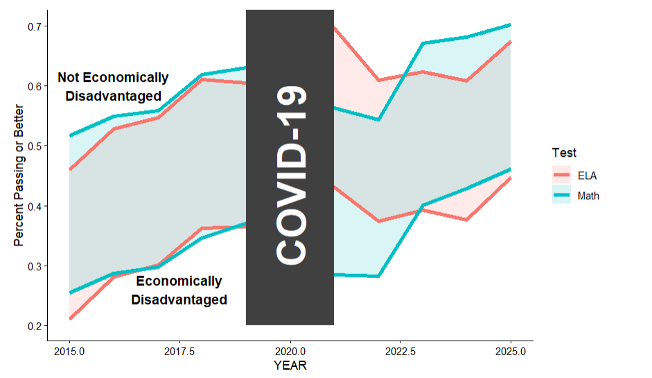

The New York State School Report Card, 2024-25 release, tracks spending, test
scores, attendance, and teacher staffing for every district and school in the
state. Read together, those tables speak to three questions:

1.  How does money affect pupil performance at these schools?
2.  How have test scores trended over the last few years, and what does the
    increase/dropoff look like for affluent schools versus poorer schools? And
    how does it compare in math versus reading?
3.  In what ways are disadvantaged schools disadvantaged versus their peers?

A longer run of data would open a fourth question: how AI and social media track with changes in student performance over time.


```{r setup}
#| message: false
#| warning: false
library(tidyverse)
library(ggrepel)
library(ggtext)
library(scales)
```

## Data loading

The database has around 30 tables. The ones that look useful for the 
questions are the math and ELA exam tables, the expenditures table, the
chronic absenteeism table, and the two teacher tables (inexperienced teachers
and out-of-certification teachers).

```{r}
#| message: false
math_exams = read_csv("data/Annual_EM_MATH.csv", show_col_types = FALSE)
ela_exams  = read_csv("data/Annual_EM_ELA.csv",  show_col_types = FALSE)
expenditures = read_csv("data/Expenditures_per_Pupil.csv", show_col_types = FALSE)
absenteeism = read_csv("data/Chronic_Absenteeism.csv", show_col_types = FALSE)
inexp_teachers = read_csv("data/Inexperienced_Teachers.csv", show_col_types = FALSE)
out_of_cert = read_csv("data/Out_of_Cert_Teachers.csv", show_col_types = FALSE)
```

The exam tables are pretty big (around 650k rows each) because every row is a
school × assessment × subgroup combination. The expenditure and teacher tables
are at the district level, which is one row per district per year, so they're
much smaller.

```{r}
#| include: false
math_exams |> count(YEAR)
```

The dataset covers only 2024 and 2025, so any trend here rests on just two data
points. Earlier SRC releases would extend that window for the final.

```{r}
#| include: false
math_exams |> count(SUBGROUP_NAME)
```

The exam tables already break each result down into a long list of subgroups
(Economically Disadvantaged, English Language Learner, race/ethnicity, gender,
homeless, foster care, etc.). That's helpful, because it already provides a definition
of disadvantaged.

```{r}
#| include: false
math_exams |> count(ASSESSMENT_NAME)
```

MATH3_8 is a roll-up summary, but its MEAN_SCORE column is empty. The
grade-level rows (MATH3 through MATH8) carry the actual scale scores, so those
are the rows behind every comparable number below.

The ENTITY_CD column is a 12-digit code identifying both districts and schools.
District codes end in 0000; school codes do not. The expenditures table mixes
both, so the joins below keep only district rows, since the aggregate is what
matters.

```{r}
#| include: false
expenditures |>
  filter(YEAR == 2024) |>
  count(district = grepl("0000$", ENTITY_CD))
```

Around 700 districts and 4500 schools.

## Goal 1: Does money buy performance?

The intuitive expectation is simple: districts that spend more per pupil should
score higher. Plotting per-pupil spending against average math scores tests it
directly.

```{r goal1-data}
#| message: false

# District-level average math score (grades 3-8, all students, 2024)
district_math = math_exams |>
  filter(
    ASSESSMENT_NAME %in% c("MATH3","MATH4","MATH5","MATH6","MATH7","MATH8"),
    SUBGROUP_NAME == "All Students",
    YEAR == 2024,
    grepl("0000$", ENTITY_CD)
  ) |>
  group_by(ENTITY_CD, ENTITY_NAME) |>
  summarize(avg_math_score = mean(as.numeric(MEAN_SCORE), na.rm = TRUE),
            .groups = "drop")

# % economically disadvantaged per district
district_pct_ed = math_exams |>
  filter(
    ASSESSMENT_NAME %in% c("MATH3","MATH4","MATH5","MATH6","MATH7","MATH8"),
    SUBGROUP_NAME %in% c("All Students", "Economically Disadvantaged"),
    YEAR == 2024,
    grepl("0000$", ENTITY_CD)
  ) |>
  group_by(ENTITY_CD, SUBGROUP_NAME) |>
  summarize(n = sum(as.numeric(TOTAL_COUNT), na.rm = TRUE), .groups = "drop") |>
  pivot_wider(names_from = SUBGROUP_NAME, values_from = n) |>
  mutate(pct_ed = 100 * `Economically Disadvantaged` / `All Students`) |>
  select(ENTITY_CD, pct_ed)

# Per-pupil spending split by source (2024, districts >= 100 pupils)
district_money = expenditures |>
  filter(YEAR == 2024, grepl("0000$", ENTITY_CD), PUPIL_COUNT_TOT >= 100) |>
  select(ENTITY_CD,
         per_pupil_spending = PER_FED_STATE_LOCAL_EXP,
         federal_pp         = PER_FEDERAL_EXP,
         statelocal_pp      = PER_STATE_LOCAL_EXP)

# Full joined dataset
districts = district_math |>
  inner_join(district_money, by = "ENTITY_CD") |>
  inner_join(district_pct_ed, by = "ENTITY_CD") |>
  filter(!is.na(avg_math_score), !is.na(pct_ed), !is.na(per_pupil_spending),
         !grepl("^0{6}", ENTITY_CD))
```

### The puzzle: spending and scores move in the wrong direction

```{r goal1-plot1}
#| fig-width: 8
#| fig-height: 5.5


ggplot(districts, aes(x = per_pupil_spending, y = avg_math_score)) +
  geom_point(alpha = 0.45, size = 2.2, color = "steelblue") +
  scale_x_continuous(
    labels = label_dollar(scale = 1e-3, suffix = "k"),
    limits = c(NA, 90000)
  ) +
  labs(
    title    = "Spending doesn't predict scores. If anything, the pattern runs backwards",
    subtitle = "Each point is a NY school district, 2024–25.",
    x        = "Per-pupil spending (federal + state + local)",
    y        = "Average grade 3–8 math scale score",
    caption  = NULL
  ) +
  theme_minimal(base_size = 13) +
  theme(
    plot.title    = element_text(face = "bold", size = 14),
    plot.subtitle = element_text(color = "gray40", size = 10.5),
    plot.caption  = element_text(color = "gray55", size = 8)
  )
```

There's no upward pattern. If anything, higher spending is weakly associated
with *lower* scores, the reverse of that expectation. So what explains it?

### Why high-need districts spend more: equity funding at work

```{r goal1-plot2}
#| fig-width: 8
#| fig-height: 4.8

districts_q = districts |>
  mutate(need_group = cut(
    pct_ed,
    breaks = quantile(pct_ed, probs = 0:5/5, na.rm = TRUE),
    labels = c("Lowest need\n(0–20th %ile)", "Low need\n(20–40th %ile)",
               "Middle\n(40–60th %ile)",     "High need\n(60–80th %ile)",
               "Highest need\n(80–100th %ile)"),
    include.lowest = TRUE
  ))

funding_long = districts_q |>
  group_by(need_group) |>
  summarize(Federal         = mean(federal_pp,    na.rm = TRUE),
            `State & Local` = mean(statelocal_pp, na.rm = TRUE),
            .groups = "drop") |>
  pivot_longer(cols = c("Federal", "State & Local"),
               names_to = "source", values_to = "spending") |>
  mutate(source = factor(source, levels = c("State & Local", "Federal")))

totals = funding_long |>
  group_by(need_group) |>
  summarize(total = sum(spending), .groups = "drop")

ggplot(funding_long, aes(x = need_group, y = spending, fill = source)) +
  geom_col(width = 0.65) +
  geom_text(data = totals,
            aes(x = need_group, y = total,
                label = dollar(total, scale = 1e-3, suffix = "k")),
            inherit.aes = FALSE,
            vjust = -0.4, size = 3.4, fontface = "bold", color = "gray20") +
  scale_y_continuous(labels = label_dollar(scale = 1e-3, suffix = "k"),
                     expand = expansion(mult = c(0, 0.1))) +
  scale_fill_manual(values = c("Federal" = "#e08214", "State & Local" = "#4d9de0"),
                    name = "Funding source") +
  labs(
    title    = "Equity aid flows to high-need districts, but state & local funding barely changes",
    subtitle = "Average per-pupil spending by district needs quintile, 2024–25.",
    x        = NULL, y = "Average per-pupil spending",
    caption  = NULL
  ) +
  theme_minimal(base_size = 13) +
  theme(
    plot.title    = element_text(face = "bold", size = 13.5),
    plot.subtitle = element_text(color = "gray40", size = 10.5),
    legend.position = "top",
    plot.caption  = element_text(color = "gray55", size = 8),
    panel.grid.major.x = element_blank()
  )
```

High-need districts do receive more money overall, mainly through federal aid.
But that extra funding hasn't translated into higher scores, which suggests
money alone isn't enough to close the gap.

### The real driver: poverty, not spending

```{r goal1-plot3}
#| fig-width: 8
#| fig-height: 5.5

ggplot(districts, aes(x = pct_ed, y = avg_math_score, color = per_pupil_spending)) +
  geom_point(alpha = 0.55, size = 2.2) +
  geom_smooth(method = "lm", color = "gray20", linewidth = 1,
              se = FALSE) +
  scale_x_continuous(labels = function(x) paste0(x, "%")) +
  scale_color_viridis_c(
    option = "plasma", direction = -1,
    name   = "Per-pupil\nspending",
    labels = label_dollar(scale = 1e-3, suffix = "k"),
    breaks = c(20000, 35000, 50000, 75000)
  ) +
  labs(
    title    = "Poverty rate predicts scores far more cleanly than spending does",
    x        = "% of students economically disadvantaged",
    y        = "Average grade 3–8 math scale score"
  ) +
  theme_minimal(base_size = 13) +
  theme(
    plot.title    = element_text(face = "bold", size = 13.5),
    plot.subtitle = element_text(color = "gray40", size = 10.5),
    legend.position = "right",
    plot.caption  = element_text(color = "gray55", size = 8)
  )
```

```{r goal1-cors}
#| echo: false
r_spend = cor(districts$per_pupil_spending, districts$avg_math_score,
              use = "complete.obs") |> round(2)
r_pov   = cor(districts$pct_ed, districts$avg_math_score,
              use = "complete.obs") |> round(2)
```

Poverty rate is a strong predictor of scores (r = `r r_pov`), far more so than
spending (r = `r r_spend`). That raises the next question: how wide is this
gap, and is it closing?

## Goal 2: Affluent vs poorer schools in math and reading

If poverty predicts scores more cleanly than spending, the next question is
how wide that gap actually is, and whether it's moving. Across grades 3 to 8,
economically disadvantaged students sit roughly 13 to 14 scale-score points
behind their peers in both math and ELA, and that gap barely moves between 2024
and 2025. Math runs a hair wider than ELA, but the two subjects don't share a
scale, so that's a soft observation. Two years is a short window, though, and
the longer view is more revealing.

### The longer view: COVID broke the trend



Before the pandemic, both groups climbed together. After, math fell harder
than ELA for economically disadvantaged students, and they haven't recovered
to their pre-pandemic trajectory the way their peers have. The flat 2024–2025
gap isn't steady state. It's the tail end of a bigger setback.

## Goal 3: How are disadvantaged schools disadvantaged?

A gap this wide and this stuck rarely runs on student effort alone. Two
structural mechanisms are measurable in this dataset: how often students
show up, and who's teaching them. Attendance comes first, and it is far from
equal across subgroups.

```{r}
absent_2024 = absenteeism |>
  filter(YEAR == 2024) |>
  mutate(ENROLLMENT   = suppressWarnings(as.numeric(ENROLLMENT)),
         ABSENT_COUNT = suppressWarnings(as.numeric(ABSENT_COUNT)),
         ABSENT_RATE  = suppressWarnings(as.numeric(ABSENT_RATE)))

not_ed = absent_2024 |>
  filter(SUBGROUP_NAME %in% c("All Students", "Economically Disadvantaged")) |>
  select(ENTITY_CD, SUBGROUP_NAME, ENROLLMENT, ABSENT_COUNT) |>
  pivot_wider(names_from = SUBGROUP_NAME,
              values_from = c(ENROLLMENT, ABSENT_COUNT)) |>
  mutate(enroll = `ENROLLMENT_All Students` - `ENROLLMENT_Economically Disadvantaged`,
         absent = `ABSENT_COUNT_All Students` - `ABSENT_COUNT_Economically Disadvantaged`,
         ABSENT_RATE = ifelse(enroll > 0, 100 * absent / enroll, NA)) |>
  filter(!is.na(ABSENT_RATE)) |>
  summarize(SUBGROUP_NAME = "Not Economically Disadvantaged",
            avg_attend_rate = 100 - mean(ABSENT_RATE, na.rm = TRUE))

absent_by_group = absent_2024 |>
  filter(SUBGROUP_NAME %in% c("Economically Disadvantaged",
                              "English Language Learner",
                              "Students with Disabilities",
                              "All Students")) |>
  group_by(SUBGROUP_NAME) |>
  summarize(avg_attend_rate = 100 - mean(ABSENT_RATE, na.rm = TRUE),
            .groups = "drop") |>
  bind_rows(not_ed)

all_students_rate = absent_by_group |>
  filter(SUBGROUP_NAME == "All Students") |>
  pull(avg_attend_rate)

group_colors = c(
  "Economically Disadvantaged"     = "#c0392b",   # red
  "English Language Learner"       = "#e67e22",   # amber
  "Students with Disabilities"     = "#2980b9",   # steel blue
  "Not Economically Disadvantaged" = "#27ae60"    # teal
) 

absent_by_group |>
  filter(SUBGROUP_NAME != "All Students") |>
  ggplot(aes(x = reorder(SUBGROUP_NAME, avg_attend_rate),
             y = avg_attend_rate,
             fill = SUBGROUP_NAME)) +
  geom_col(width = 0.6) +
  geom_hline(yintercept = all_students_rate,
             linetype = "dashed", colour = "grey40", linewidth = 0.5) +

  annotate("text", #avg student line
           x     = 2,              
           y     = all_students_rate,
           label = sprintf("Average across all students (%.1f%%)", all_students_rate),
           hjust = 1.05,              
           vjust = -0.5,
           size  = 3.2,
           colour = "grey40") + 
  geom_text(aes(label = sprintf("%.1f%%",     avg_attend_rate)),
            hjust = 0.5, vjust = 2, size = 3.5, colour = "white", fontface = "bold") +
  scale_y_continuous(breaks = seq(30, 100, by = 10), expand = c(0, 0)) +
  coord_cartesian(ylim = c(30, 100)) +

  scale_fill_manual(values = group_colors) +
  labs(
    x = NULL,
    y = "Average Attendance Rate (%)",
    title = "Economic and learning disadvantages reduce school attendance",
    subtitle = "Attendance rate = 100 minus chronic absenteeism rate.\nChronic absenteeism defined as missing \u226510% of school days, 2024.",
    caption = "Source: NY State absenteeism data."
  ) +
  scale_x_discrete(labels = function(x) str_wrap(x, width = 15)) +
  theme_minimal(base_size = 12) +
  theme(
  legend.position    = "none",
  plot.title         = element_text(face = "bold"),
  plot.subtitle      = element_text(colour = "grey30"),
  plot.caption       = element_text(colour = "grey50", size = 9),
  panel.grid.major.x = element_blank(),
  axis.line          = element_line(colour = "grey20", linewidth = 0.6),
  panel.grid.major.y = element_line(colour = "grey85", linewidth = 0.4),
  axis.text.x = element_text(size = 9)
)
```
Economically disadvantaged students miss roughly twice as much school as their
peers. An academic gap can't close from outside the building, which makes
absenteeism a plausible cause and not just a symptom.

### High-need districts shoulder rougher staffing too

Teacher data isn't broken out by student subgroup, so the lens shifts to the
district level: do high-need districts get a worse staffing deal?

```{r}
district_ed = math_exams |>
  mutate(
    ENTITY_CD = as.character(ENTITY_CD),
    TOTAL_COUNT = as.numeric(TOTAL_COUNT)
  ) |>
  filter(
    YEAR == 2024,
    ASSESSMENT_NAME %in% c("MATH3", "MATH4", "MATH5", "MATH6", "MATH7", "MATH8"),
    SUBGROUP_NAME %in% c("All Students", "Economically Disadvantaged"),
    grepl("0000$", ENTITY_CD)
  ) |>
  group_by(ENTITY_CD, ENTITY_NAME, SUBGROUP_NAME) |>
  summarize(total_students = sum(TOTAL_COUNT, na.rm = TRUE), .groups = "drop") |>
  pivot_wider(
    names_from = SUBGROUP_NAME,
    values_from = total_students
  ) |>
  mutate(
    pct_econ_disadvantaged =
      100 * `Economically Disadvantaged` / `All Students`
  ) |>
  filter(!is.na(pct_econ_disadvantaged)) |>
  mutate(
    need_group_num = ntile(pct_econ_disadvantaged, 4),
    need_group = case_when(
      need_group_num == 1 ~ "Low-need districts\n(bottom 25%)",
      need_group_num %in% c(2, 3) ~ "Middle districts",
      need_group_num == 4 ~ "High-need districts\n(top 25%)"
    ),
    need_group = factor(
      need_group,
      levels = c(
        "Low-need districts\n(bottom 25%)",
        "Middle districts",
        "High-need districts\n(top 25%)"
      )
    )
  )

teacher_dists = bind_rows(
  inexp_teachers |>
    mutate(ENTITY_CD = as.character(ENTITY_CD)) |>
    filter(YEAR == 2024, grepl("0000$", ENTITY_CD)) |>
    transmute(
      ENTITY_CD,
      ENTITY_NAME,
      pct = as.numeric(PER_TEACH_INEXP),
      metric = "Inexperienced teachers (<4 yrs)"
    ),

  out_of_cert |>
    mutate(ENTITY_CD = as.character(ENTITY_CD)) |>
    filter(YEAR == 2024, grepl("0000$", ENTITY_CD)) |>
    transmute(
      ENTITY_CD,
      ENTITY_NAME,
      pct = as.numeric(PER_OUT_CERT),
      metric = "Teaching out of certification"
    )
)

teacher_need = teacher_dists |>
  left_join(
    district_ed |> select(ENTITY_CD, pct_econ_disadvantaged, need_group),
    by = "ENTITY_CD"
  ) |>
  filter(!is.na(pct), !is.na(pct_econ_disadvantaged))

teacher_need |>
  ggplot(aes(x = need_group, y = pct, fill = need_group)) +
  geom_boxplot(width = 0.5, alpha = 0.7, outlier.shape = NA) +
  facet_wrap(~ metric, scales = "free_y") +
  labs(
    x = NULL,
    y = "Teachers in category (%)",
    title = "High-need districts tend to have more teacher staffing instability",
    subtitle = "Districts are grouped by their share of economically disadvantaged students, 2024",
    fill = NULL
  ) +
  theme_minimal() +
  theme(legend.position = "none")
```

High-need districts carry higher shares of inexperienced teachers and teachers working out of certification. Within each need group the pattern isn't identical district to district, but the spread shifts upward as need rises, with a heavier tail where teacher instability runs unusually high. The disadvantage extends beyond student test scores into less stable teacher staffing, part of what high-need districts are up against.